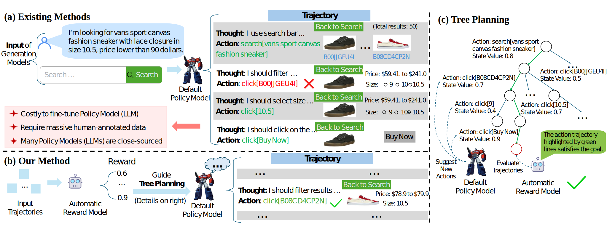

# ARMAP: Scaling Autonomous Agents via Automatic Reward Modeling And Planning

[ [Project Page](https://armap-agent.github.io) | [Paper](TBD) ]



This repository contains the official code for ARMAP: Scaling Autonomous Agents via Automatic Reward Modeling And Planning

## Reward Model
Reward model training pipline is provided in [the reward model directory](./RM).

## Inference
After starting the reward model server, please refer to the eval folder for each task:

[webshop](./Eval/webshop)

[game24](./Eval/game24)

[sciworld](./Eval/sciworld)


## Citation
If you use this work or find it helpful, please consider citing: (bibtex)
```
@misc{chen2025scalingautonomousagentsautomatic,
      title={Scaling Autonomous Agents via Automatic Reward Modeling And Planning}, 
      author={Zhenfang Chen and Delin Chen and Rui Sun and Wenjun Liu and Chuang Gan},
      year={2025},
      eprint={2502.12130},
      archivePrefix={arXiv},
      primaryClass={cs.AI},
      url={https://arxiv.org/abs/2502.12130}, 
}
```
